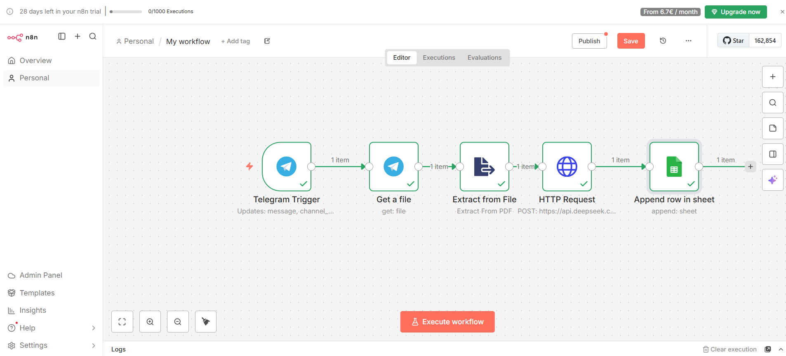
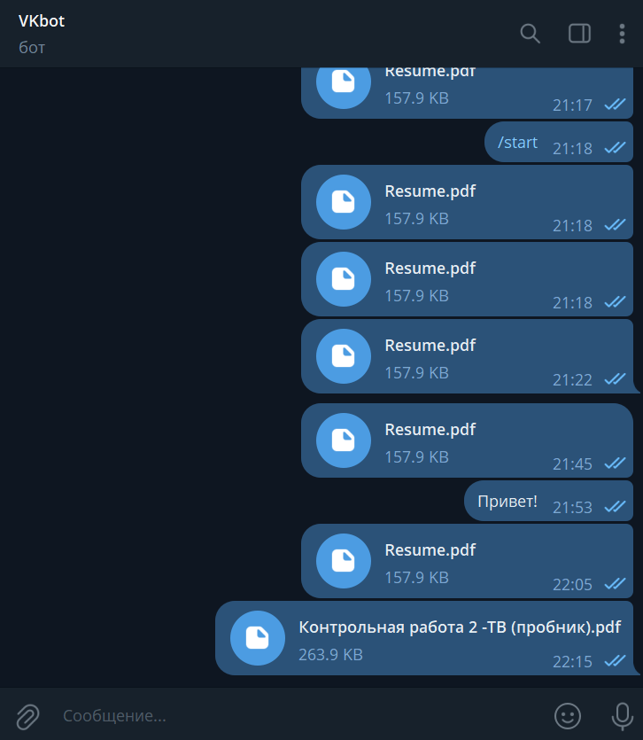
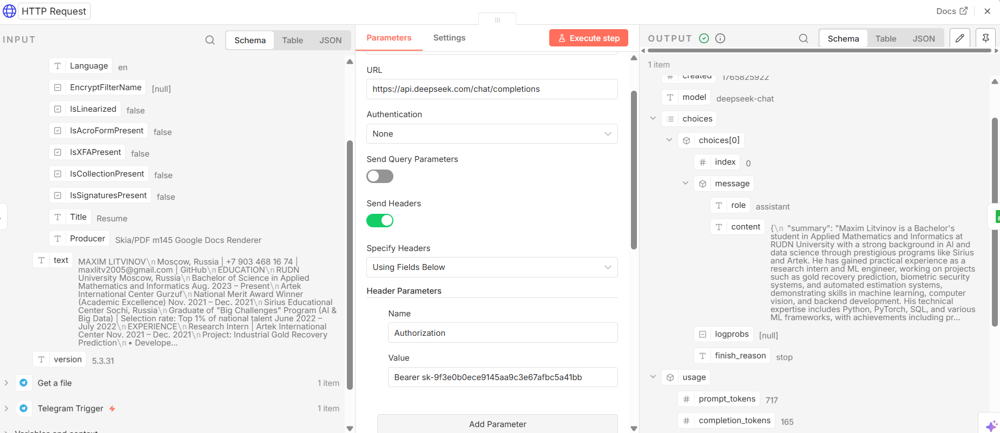
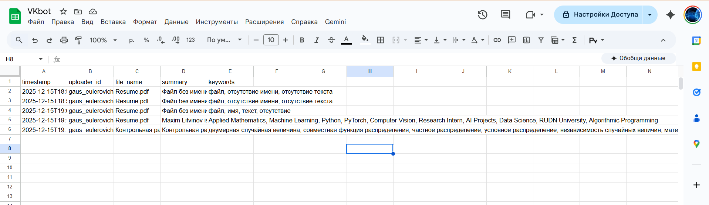

# 🤖 AI-Assistant for Knowledge Base (VK Internship Task)

Решение профильного задания на позицию Backend/AI стажера.
Бот автоматизирует процесс наполнения базы знаний: принимает документы, генерирует краткое содержание (summary) с помощью LLM и структурирует данные в Google Sheets.

## 🔗 О проекте
* **Бот:** @VK_intern_2025_bot (ID: ВСТАВЬ_СЮДА_ID_ИЗ_BOTFATHER)
* **Стек:** n8n, DeepSeek V3 (via API), Google Sheets, Telegram Bot API.

---

## 🛠 Архитектура решения (ETL Pipeline)
Реализован пайплайн на платформе **n8n**, который работает по принципу ETL (Extract, Transform, Load):

1.  **Extract (Извлечение):** Telegram Trigger перехватывает файлы (PDF) и сообщения. Модуль парсинга извлекает текстовый слой.
2.  **Transform (Трансформация):** Текст отправляется в DeepSeek API с системным промптом для форматирования в JSON.
3.  **Load (Загрузка):** Распаршенный JSON (summary + keywords) сохраняется в Google Sheets.

### 1. Общая схема сценария (Workflow)

---

## 📷 Демонстрация работы

### Шаг 1: Взаимодействие с ботом
Пользователь отправляет PDF-файл (резюме, статья). Бот принимает файл и запускает сценарий обработки.

### Шаг 2: Настройка AI-аналитика
Использован `HTTP Request` к API DeepSeek.
* **Особенность:** Использован `JSON.stringify` для валидации входного текста и `response_format: json_object` для получения строго структурированного ответа.

### Шаг 3: Результат в базе знаний
Данные автоматически попадают в таблицу. Корректно заполняются поля: имя файла, ID пользователя, AI-саммари и ключевые слова.

---

## 🧠 Технические решения
* **Парсинг PDF:** Для работы с документами использован модуль `Extract from File`, который позволяет работать с бинарными данными и превращать их в текст для LLM.
* **Валидация JSON:** Чтобы избежать ошибок при генерации, использован строгий режим JSON в промпте нейросети.
* **Масштабируемость:** Архитектура позволяет легко добавить ветвление (Switch Node) для поддержки других форматов (DOCX, Images) без переписывания основной логики.

## 🚀 Точки роста (Future Improvements)
1.  **OCR (Tesseract):** Добавить распознавание текста для сканированных документов (сейчас обрабатывается текстовый слой).
2.  **Vector Store (Pinecone):** Сохранять эмбеддинги саммари для семантического поиска по базе знаний (RAG).
3.  **Error Handling:** Добавить уведомления пользователю, если файл не удалось прочитать.
